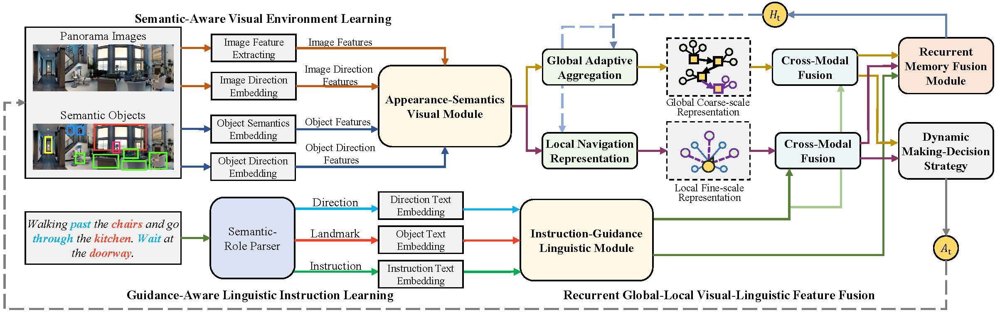

# A Dual Semantic-Aware Recurrent Global-Adaptive Network For Vision-and-Language Navigation

This repository is the official implementation of A Dual Semantic-Aware Recurrent Global-Adaptive Network For Vision-and-Language Navigation. 


Vision-and-Language Navigation (VLN) is a realistic but challenging task that requires an agent to locate the target region using verbal and visual cues. While significant advancements have been achieved recently, there are still two broad limitations: (1) The explicit information mining for significant guiding semantics (e.g., directions and landmarks) concealed in both vision and language is still under-explored; (2) The previously structured map method provides the average historical appearance of visited nodes, while it ignores distinctive contributions of various images and potent information retention in the reasoning process. This work proposes a dual semantic-aware recurrent global-adaptive network (DSRG) to address the above problems. First, DSRG proposes an instruction-guidance linguistic module (IGL) and an appearance-semantics visual module (ASV) for boosting vision and language semantic learning respectively. Additionally, for memory mechanism, we devise a global adaptive aggregation module (GAA) for explicit panoramic observation fusion and introduce a recurrent memory fusion module (RMF) to supply implicit temporal hidden states. Extensive experimental results on the R2R and REVERIE datasets demonstrate that our method achieves better performance than existing methods.




## 1) Installation

1. Please refer to [VLN-DUET](https://github.com/cshizhe/VLN-DUET)'s official github repository for installation guides.

2. Some requirements are updated in this project. Please refer to our `requirements.txt`.

3. Download [category_mapping.tsv](https://www.dropbox.com/s/i5fid7fcaie2xpm/category_mapping.tsv?dl=0) and put it to `datasets\R2R\annotations`. 

4. Download [object_bbox_v2.json](https://www.dropbox.com/s/rvt6xdf42ah2d8b/object_bbox_v2.json?dl=0) for fine-grained object features and put them to `datasets\REVERIE\features`.

4. (Optional) Download [pretrained weights](https://www.dropbox.com/scl/fo/fn4mp70wsa21og3zbk8jm/h?dl=0&rlkey=12m8oghwmki0kt9iutzv3tzlv) for R2R and REVERIE.


## 2) Pretraining

Use the following command to pre-train the model based on LXMERT weights:
```pretrain
cd pretrain_src
bash run_r2r.sh # (or: run_reverie.sh)
```

## 3) Fine-tuning & Evaluation

Use the following command to fine-tune or evaluate the trained model:
```finetune
cd finetune_src
bash scripts/run_r2r.sh # (or: run_reverie.sh)
```

```Evaluation
cd finetune_src
bash scripts/run_r2r_valid.sh # (or: run_reverie_valid.sh)
```

## Acknowledge
Our code is built mainly based on [DUET](https://github.com/cshizhe/VLN-DUET). We thank to the authors for their awesome work and sharing.


## BibTeX
If you find our work useful in your research, please consider citing:
```
@InProceedings{Wang2023DSRG,
    author    = {Wang, Liuyi and He, Zongtao and Tang, Jiagui and Dang, Ronghao and Wang, Naijia and Liu, Chengju and Chen, qijun},
    title     = {A Dual Semantic-Aware Recurrent Global-Adaptive Network For Vision-and-Language Navigation},
    booktitle = {IJCAI},
    year      = {2023}
}
```
